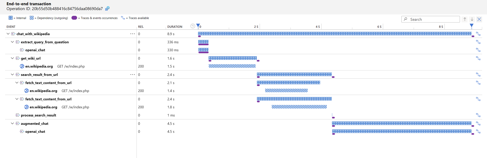

# Auto-instrumenting Prompt Flow Application usign OpenTelemetry

> Note: this sample is based on the source code exploration and is not officially documented as a way to setup
> OpenTelemetry for Prompt Flow applications.

## How to run the sample

1. Install dependencies:

```bash
pip install -r requirements.txt
```

2. Create an Azure OpenAI connection:

```bash
pf connection create --file ./connections/azure_openai.yaml --set api_key=<your API key> api_base=<API base URL>
```

3. Create an `.env` file based on the `.env.example` file and fill with correct values for your environment

4. Run the flow:

```bash
pf flow test --flow .\chat-with-wikipedia\
```

## Instrumentation

Instrumentation is setup in the `instrumentation.py` file and is based on [Azure Monitor Opentelemetry Distro client
library for
Python](https://learn.microsoft.com/en-us/python/api/overview/azure/monitor-opentelemetry-readme?view=azure-python).

By importing the instrumentation module in PF nodes, we make it execute the `configure_tracing_and_logging()` top level
function.

This function configures the OpenTelemetry SDK with the Azure Monitor exporter and sets up the tracing and logging that
is subsequently used by the Prompt Flow for instrumentation of nodes.

### One transaction example in Azure Application Insights


